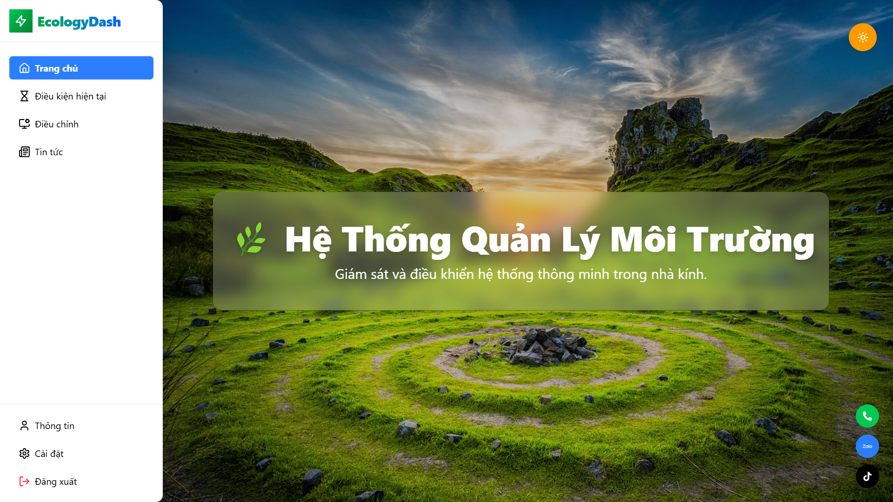
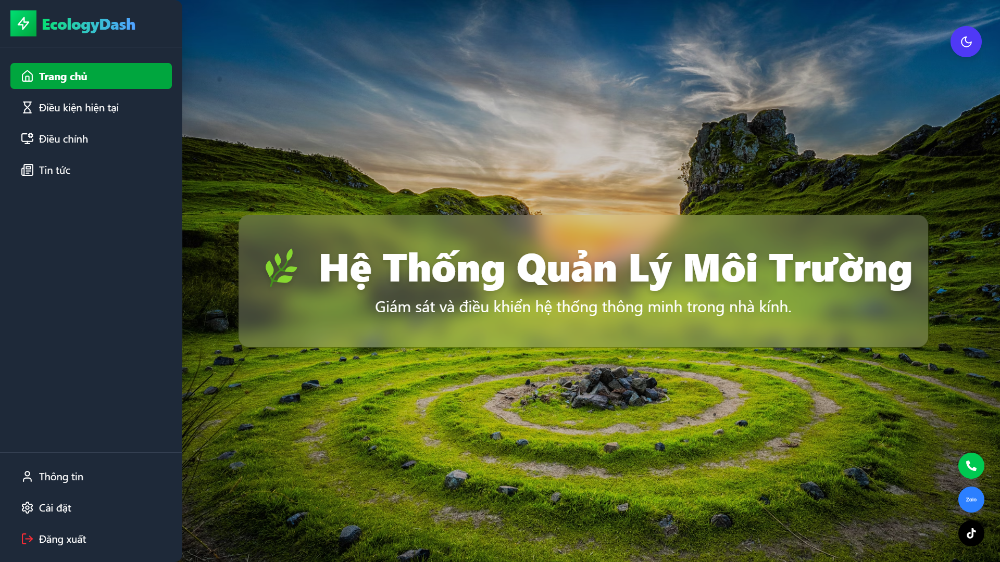
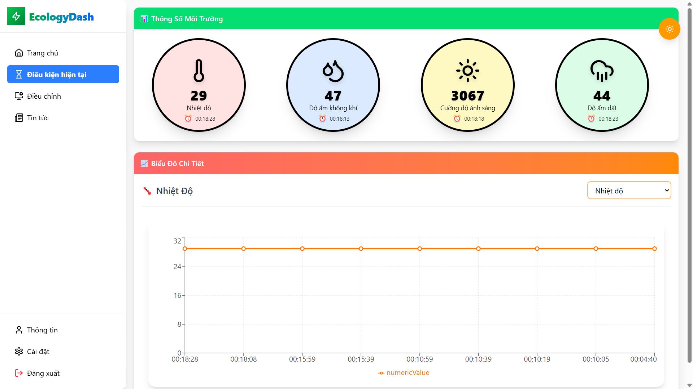
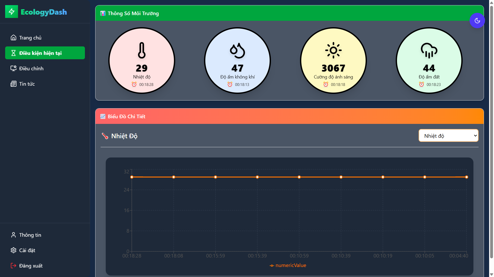
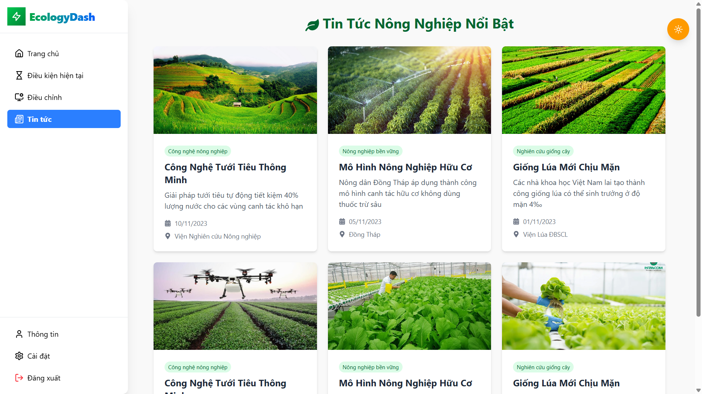
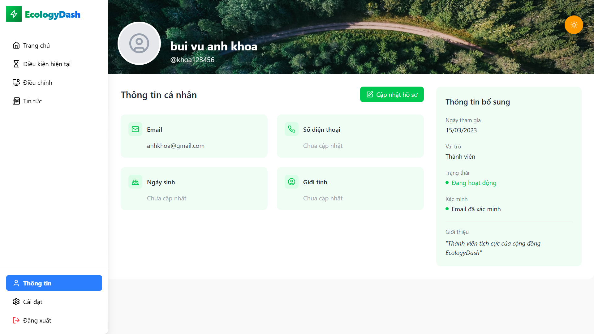
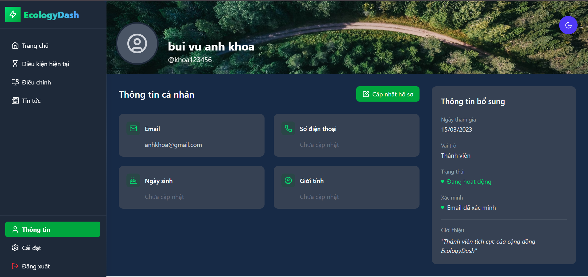

Ecology Dashboard Project
🛠 Technologies Used
Frontend:
React: A JavaScript library for building user interfaces.

TailwindCSS: A utility-first CSS framework for rapid UI development.

Vite: A fast build and development tool for React.

Backend:
Java & Spring Boot: A powerful framework for building REST APIs and handling data.

Spring Security: Ensures authentication and authorization security.

Spring Data JPA: Simplifies database interaction.

🚀 How to Run the Project
Start the Frontend:
cd Ecology-Dashboard-Client
npm install
npm run dev

Website Screenshot:
1. Home
- Normal:

- Darkmode:

2. Data Page:
- Normal:

- Darkmode:

3. News Page:
- Normal:

- Darkmode:

4. Profile Page:
- Normal:

- Darkmode:

